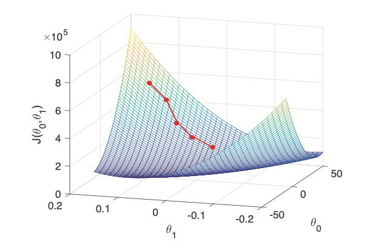
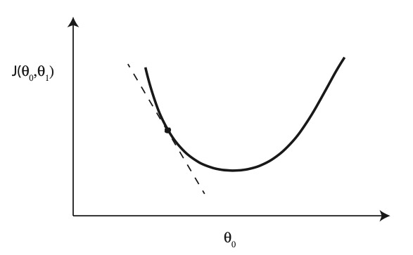
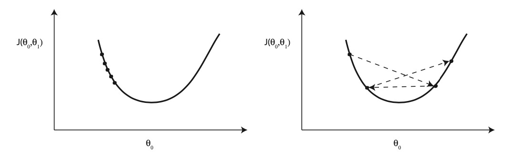

# week 02

## Linear Regression on One Variable

```text

               Training Data
                    |
                    V
            Learning Algorithm
                    |
                    V
TV Budget X --> h_\theta ------> Preidicted Sales \hat{Y}

```

### Prediction

$$
\hat{y} = h_\theta(x) = \theta_0 + \theta_1 x
$$

where:

- $\theta_0$ $\theta_1$ are (unknown) parameters
- sometimes abbreviate $h_\theta(x)$ to $h(x)$

### Cost function

- having prediction: $\hat{y} = h_\theta(x) = \theta_0 + \theta_1 x
$
- idea: choose $\theta_0$ and $\theta_1$ so that $h_\theta(x)$ is close to $y^{(i)}$ for each of our training examples $(x^{(i)},\ y^{(i)}),i = 1,...,m$
- least squares case: select the values for $\theta_0$ and $\theta_1$ that minimise cost function:

$$
J(\theta_0, \theta_1) = \frac{1}{m} \sum^m_{i = 1} (h_\theta(x^{(i)} - y^{(i)})^2
$$

### Gradient Descent

Need to select $\theta_0$ and $\theta_1$ that minimise $J(\theta_0, \theta_1)$.

Brute force search over pairs of values of $\theta_0$ and $\theta_1$ is inefficient, can we be smarter?

- Start with some $\theta_0$ and $\theta_1$
- Repeat
  - Update $\theta_0$ and $\theta_1$ to new value which makes $J(\theta_0, \theta_1)$ smaller



- Start with some $\theta_0$ and $\theta_1$
- Repeat:
  - Update θ0 and θ1 to new value which makes $J(\theta_0, \theta_1)$ smaller
- When curve has several minima then we can’t be sure which we will
converge to.
- Might converge to a local minimum, not the global minimum


Try gradient descent:

- Repeat: Update $\theta_0$ and $\theta_1$ to new value which makes $J(\theta_0, \theta_1)$ smaller
  - One option: carry out local search of $\theta_0$ and $\theta_1$ to find one that decreases J.
  - Another option: gradient descent:

$$
temp0 := \theta_0 - \alpha \frac{\partial}{\partial \theta_0} J(\theta_0, \theta_1) \\
temp0 := \theta_0 - \alpha \frac{\partial}{\partial \theta_0} J(\theta_0, \theta_1) \\
\theta_0 := temp0, \theta_1 := temp1 \\
$$

- $\frac{\partial}{\partial \theta_0}J(\theta_0,\theta_1) \approx \frac{J(\theta_0 + \delta, \theta_1) - J(\theta_0, \theta_1)}{\delta}$ for $\delta$ sufficiently small.
- $J(\theta_0 + \delta, \theta_1) \approx J(\theta_0, \theta_1) + \delta\frac{\partial}{\partial \theta_0} J(\theta_0, \theta_1)$
- When $\delta = -\alpha\frac{\partial}{\partial \theta_0} J(\theta_0, \theta_1)$
  - then $J(\theta_0 + \delta, \theta_1) \approx J(\theta_0, \theta_1) - \alpha(\frac{\partial}{\partial \theta_0} J(\theta_0, \theta_1))^2$



- Selecting step size α too small will mean it takes a long time to converge to minimum
- But selecting α too large can lead to us overshooting the minimum
- We need to adjust α so that algorithm converges in a reasonable time.



For $J(\theta_0, \theta_1) = \frac{1}{m} \sum^m_{i = 1} (h_\theta(x^{(i)} - y^{(i)})^2$ with $h_\theta(x) = \theta_0 + \theta_1 x$ :

- $\frac{\partial}{\partial\theta_0} J(\theta_0, \theta_1) = \frac{2}{m} \sum^m_{i = 1} (h_\theta(x^{(i)} - y^{(i)})$
- $\frac{\partial}{\partial\theta_1} J(\theta_0, \theta_1) = \frac{2}{m} \sum^m_{i = 1} (h_\theta(x^{(i)} - y^{(i)}) x^{(i)}$

So **Gradient Descent** algorithm is:

- Repeat:

$$
temp0 := \theta_0 - \frac{2\alpha}{m} \sum^m_{i = 1} (h_\theta(x^{(i)}) - y^{(i)}) \\
temp1 := \theta_1 - \frac{2\alpha}{m} \sum^m_{i = 1} (h_\theta(x^{(i)}) - y^{(i)}) x^{(i)} \\
\theta_0 := temp0,\ \theta_1 := temp1
$$

## Linear Algebra Review

Its assumed you know basic linear algebra for this module. There is lots of revision material online e.g.

- https://youtu.be/6AP4IvfKmwg (coursera linear algebra review)
- https://www.khanacademy.org/math/linear-algebra

Basic notation:

- vector:
  $$
  x = \begin{bmatrix} 230.1 \\ 37.8 \end{bmatrix} \\
  x_1 = 230.1
  $$
- matrix:
  $$
  A = \begin{bmatrix} 1 & 2 \\ 3 & 4 \end{bmatrix} \\
  A_{11} = 1
  $$
- transpose:
  $$
  x^T = \begin{bmatrix} 230.1 & 37.8 \end{bmatrix}
  $$
- inner product (for two vectors with n elements):
  $$
  x^Ty = \sum^n_{i = 1} x_i y_i
  $$
- product of a matrix and a vector $Ax$, product of two matricexs $AB$

## Linear Regression with Multiple Variables

### Hypothesis

$$
h_\theta(x) = \theta^T x
$$

where $\theta$ and $x$ are now `n+1` dimensional vectors.

### Cost Function

$$
J(\theta_0, \theta_1, ... , \theta_n) \\
= J(\theta) \\
= \frac{1}{m} \sum^m_{i = 1} (h_\theta(x^{(i)}) - y^{(i)})^2
$$

### Goal

Select $\theta$ that minimise $J(\theta)$

### Using Gradient Descent

- Start with some $\theta$
- Repeat:
  - for j = 0 to n: $\{ tempj := \theta_j - \alpha \frac{\partial}{\partial \theta_j} J(\theta) \}$
  - where: $\alpha \frac{\partial}{\partial \theta_j} J(\theta) = \frac{2\alpha}{m} \sum^m_{i = 1} (h_\theta(x^{(i)}) - y^{(i)})x^{(i)}_j$
  - for j = 0 to n: $\{ \theta_j := tempj \}$
